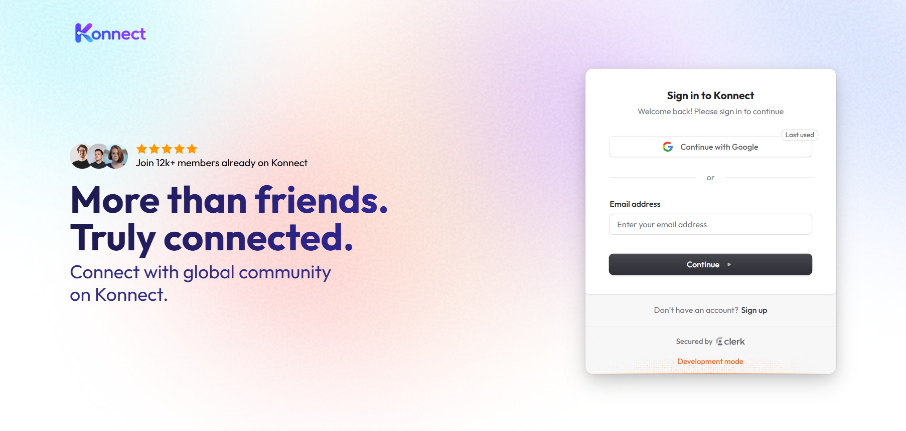
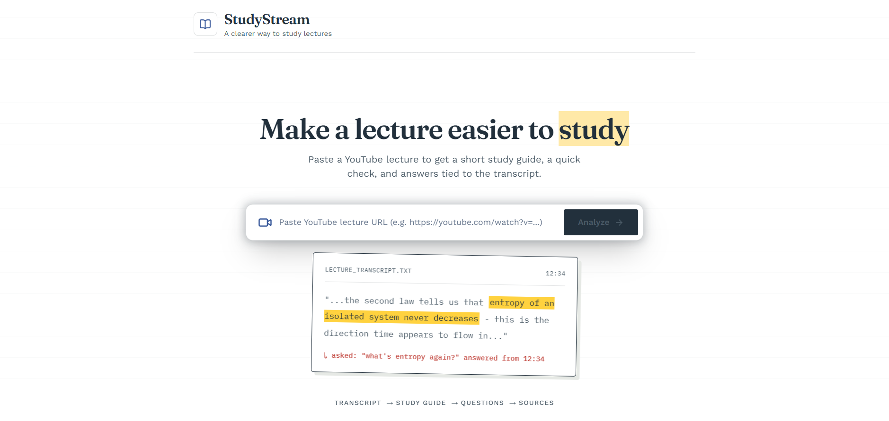
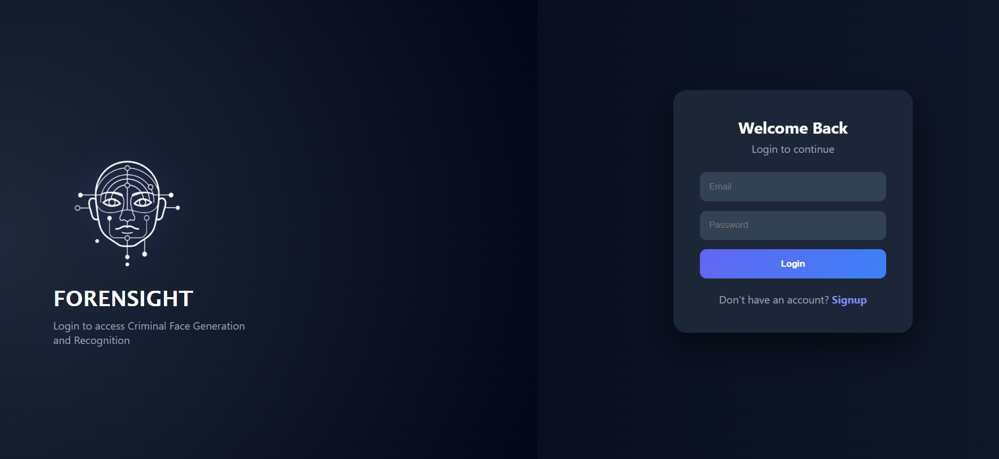
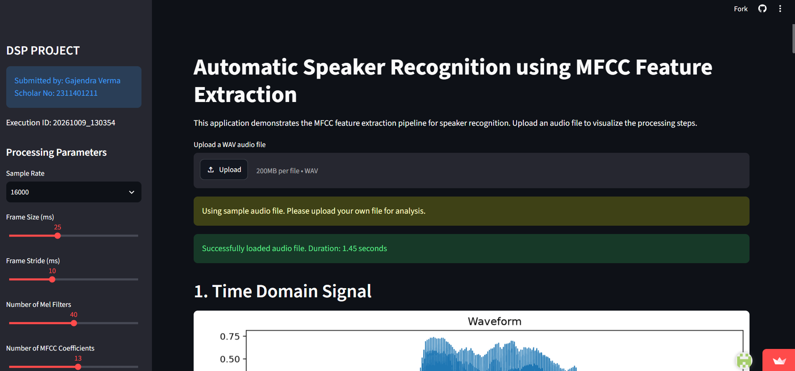

<div align="center">
  <h1>Gajendra Verma</h1>
  <p><b>Full-Stack Developer · Problem Solving · Software Engineering</b></p>
  <p>
    <a href="https://portfolio-ten-psi-ex08m96hks.vercel.app/"></a>
    <a href="https://www.linkedin.com/in/gjvrm085"></a>
    <a href="https://github.com/gaj085"></a>
    <a href="https://drive.google.com/file/d/1fJiKE8hXeNJLIlsV0YRF2YIpP4M823-z/view?usp=sharing"></a>
    <a href="mailto:gajendraverma085@gmail.com"></a>
  </p>
</div>

<p align="center">
I build responsive full-stack applications, robust backend services, and practical AI-assisted systems. Passionate about software engineering, competitive programming, and creating scalable web products with clean architecture.
</p>

## Featured Projects

### [Konnect](https://konnect-inky.vercel.app/)



A full-stack social platform featuring posts, stories, user connections, and real-time messaging with secure authentication and encrypted storage.

```
┌─────────────────────────┐     ┌──────────────────────┐     ┌────────────────────────┐
│  Client (React + Redux) │ ──> │ Express + Clerk Auth │ ──> │ MongoDB (AES-256 Enc)  │
└─────────────────────────┘     └──────────────────────┘     └────────────────────────┘
             │                             │                                  │
             ▼                             ▼                                  ▼
  Server-Sent Events (SSE)         Inngest Background Jobs            ImageKit Media CDN
```

`React.js` · `Redux Toolkit` · `Node.js` · `Express.js` · `MongoDB` · `Clerk` · `Inngest` · `ImageKit`
- [GitHub Repository](https://github.com/gaj085/Konnect) · [Live Demo](https://konnect-inky.vercel.app/)

### [StudyStream](https://study-stream-rose.vercel.app/)



Transforms YouTube lectures into searchable knowledge using timestamped captions, vector search, and assistive AI synthesis.

```
┌──────────────────────┐     ┌───────────────────────┐     ┌──────────────────────┐
│ YouTube Video / Audio│ ──> │ Timestamped Captions  │ ──> │ Embeddings Pipeline  │
└──────────────────────┘     └───────────────────────┘     └──────────────────────┘
             │                             │                                  │
             ▼                             ▼                                  ▼
    AI Answer Synthesis           Vector Search Retrieval          Cited Timestamp Answers
```

`React` · `Node.js` · `Vector Search` · `RAG` · `AI Integration`
- [GitHub Repository](https://github.com/gaj085/StudyStream) · [Live Demo](https://study-stream-rose.vercel.app/)

### [Forensight](https://forensight-beta.vercel.app/)



A criminal identification platform featuring an interactive facial-composite editor, role-based authentication, and suspect matching.

```
┌────────────────────────┐     ┌───────────────────────┐     ┌────────────────────────┐
│  HTML5 Canvas Composite│ ──> │ Facial Vector Pipeline│ ──> │ Cosine Similarity Match│
└────────────────────────┘     └───────────────────────┘     └────────────────────────┘
             │                             │                                  │
             ▼                             ▼                                  ▼
  React + Drag & Transform         JWT Role Verification           Cloudinary Asset Storage
```

`React` · `Node.js` · `Express.js` · `MongoDB` · `Python` · `JWT` · `Cloudinary`
- [GitHub Repository](https://github.com/gaj085/Forensight) · [Live Demo](https://forensight-beta.vercel.app/)

### [MFCC Speaker Recognition](https://mfcc-speaker-recognition-uf5pbcssuzyqgexathdajk.streamlit.app/)



An interactive application implementing a Mel-Frequency Cepstral Coefficient feature-extraction pipeline and audio visualization dashboard.

```
┌────────────────────────┐     ┌───────────────────────┐     ┌────────────────────────┐
│ Raw Audio Input (16kHz)│ ──> │ Pre-Emphasis & Window │ ──> │ FFT & Mel Filter Banks │
└────────────────────────┘     └───────────────────────┘     └────────────────────────┘
             │                             │                                  │
             ▼                             ▼                                  ▼
  Waveform Visualization           Log Energy Spectrum             13 Cepstral Coefficients
```

`Python` · `NumPy` · `SciPy` · `Librosa` · `Matplotlib` · `Streamlit`
- [GitHub Repository](https://github.com/gaj085/mfcc-speaker-recognition) · [Live Demo](https://mfcc-speaker-recognition-uf5pbcssuzyqgexathdajk.streamlit.app/)

## Technical Stack

<div align="center">
  <p><b>Languages</b></p>
  
  <br><br>
  <p><b>Frameworks, Libraries & Full-Stack</b></p>
  
  <br><br>
  <p><b>Tools & Platforms</b></p>
  
</div>

<br>

| Category | Technical Focus |
| :--- | :--- |
| **Programming Languages** | C · C++ · Python · JavaScript · HTML · CSS |
| **Frontend Development** | React.js · Redux Toolkit · Tailwind CSS · Responsive Web Design |
| **Backend Development** | Node.js · Express.js · RESTful APIs · Server-Sent Events (SSE) · JWT · Clerk |
| **Databases & Cloud** | MongoDB · MySQL · Cloudinary · ImageKit |
| **Libraries & Tools** | NumPy · SciPy · Librosa · Matplotlib · Streamlit · Git · GitHub · Postman · VS Code |
| **CS Fundamentals** | Data Structures & Algorithms · Object-Oriented Programming · DBMS · Operating Systems · Computer Networks · System Design |

## Engineering Interests

- **Full-Stack Web Development & Distributed Systems**: Building resilient web applications, event-driven streaming APIs, and background job orchestration.
- **Data Structures, Algorithms & Problem Solving**: 500+ problems solved across competitive coding platforms; 1900 peak rating on Chess.com.
- **System Design & API Architecture**: Designing scalable REST APIs, secure authentication flows, and relational / document database models.
- **Practical AI & Information Retrieval**: Developing retrieval-augmented generation (RAG) workflows, vector search, and assistive AI product features.

## Connect With Me

<div align="center">
  <a href="https://portfolio-ten-psi-ex08m96hks.vercel.app/"></a>
  <a href="https://www.linkedin.com/in/gjvrm085"></a>
  <a href="https://github.com/gaj085"></a>
  <a href="https://drive.google.com/file/d/1fJiKE8hXeNJLIlsV0YRF2YIpP4M823-z/view?usp=sharing"></a>
  <a href="mailto:gajendraverma085@gmail.com"></a>
  <br><br>
  <p>Gajendra Verma · NIT Bhopal · <a href="mailto:gajendraverma085@gmail.com">gajendraverma085@gmail.com</a></p>
</div>
